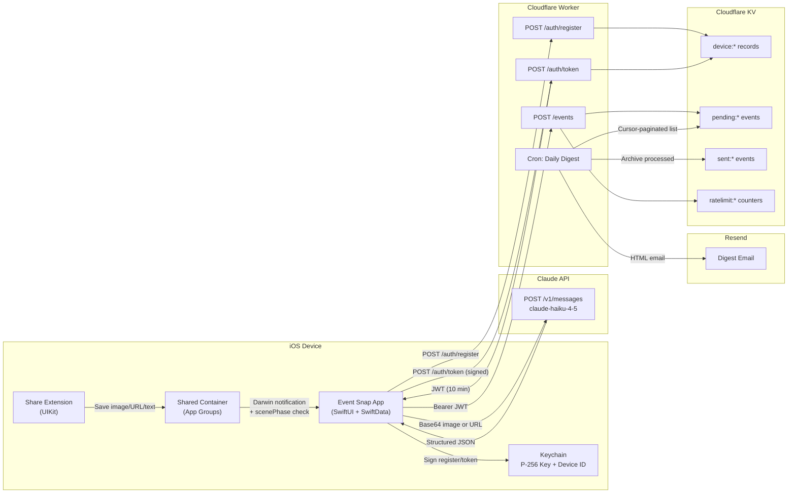

# Architecture

Event Snap is an iOS app that extracts event details from poster photos (or shared URLs/text) using Claude's vision API and creates Google Calendar events. A Cloudflare Worker provides a daily digest email pipeline with device-authenticated event ingestion.

## Tech Stack

- **iOS 17+** — SwiftUI, SwiftData, `@Observable` macro, zero SPM dependencies
- **XcodeGen** — `project.yml` → `.xcodeproj`
- **Claude API** — `claude-haiku-4-5` for vision/extraction
- **Cloudflare Worker** — TypeScript, KV storage, cron-triggered digest
- **Resend** — transactional email for daily digest

## System Diagram



## Project Structure

```
EventImage2Calendar/                      # Main app target
├── EventImage2CalendarApp.swift          # App entry + SwiftData container
├── Models/
│   ├── EventDetails.swift                # @Observable event model (in-memory) + DTO
│   └── PersistedEvent.swift              # SwiftData @Model + EventStatus enum
├── Services/
│   ├── ClaudeAPIService.swift            # Claude Messages API client (vision + text + URL)
│   ├── CalendarService.swift             # Google Calendar URL + .ics generation
│   ├── BackgroundEventProcessor.swift    # Background API calls + SwiftData persistence
│   ├── LocationService.swift             # CLLocationManager wrapper
│   ├── DigestService.swift               # POST events to Cloudflare Worker
│   ├── WorkerAuthService.swift           # Device key registration + JWT retrieval
│   └── WebSearchService.swift            # Web search capabilities
├── Views/
│   ├── ContentView.swift                 # Root (hosts EventListView)
│   ├── CameraView.swift                  # Camera sheet + ImagePicker
│   ├── EventListView.swift               # Event queue with swipe actions
│   ├── EventRowView.swift                # Compact list row
│   └── EventDetailView.swift             # Editable form + calendar buttons
└── Utilities/
    └── APIKeyStorage.swift               # Reads API key from Bundle (xcconfig)

ShareExtension/                           # Share Extension target
├── ShareViewController.swift             # NSItemProvider handler (UIKit-based)
├── ShareExtension.entitlements           # App Groups entitlement
└── Info.plist                            # Extension config + activation rules

Shared/                                   # Code shared between both targets
├── ImageResizer.swift                    # UIImage resize (1024px max, JPEG 0.7)
├── PendingShare.swift                    # Codable model for extension → app handoff
└── SharedContainerService.swift          # App Groups file read/write

cloudflare-worker/
├── wrangler.toml                         # Worker config + cron trigger (8 AM daily)
└── src/
    ├── index.ts                          # Route handlers + scheduled digest
    ├── email.ts                          # HTML digest email builder
    ├── security.ts                       # JWT issuance/verification + ECDSA signatures
    ├── validation.ts                     # Request/payload schema validation
    └── types.ts                          # TypeScript interfaces
```

## Event Lifecycle

```
Camera / Photo Library / Share Extension
                │
                ▼
    BackgroundEventProcessor
    (UIApplication.beginBackgroundTask)
                │
                ▼
        ClaudeAPIService
    (vision extraction or URL extraction)
    ┌── auto-retry (3x, exponential backoff: 2s/4s/8s)
    │   for retryable errors (network, 5xx, 429)
                │
                ▼
    PersistedEvent (SwiftData)
    status: processing → ready
                │
        ┌───────┴───────┐
        ▼               ▼
    "Add to         "Dismiss"
     Calendar"      status → dismissed
    status → added
        │
        ▼
    DigestService
    (POST to Worker)
```

**Status values:** `processing` → `ready` → `added` | `dismissed` | `failed`

**Error handling & retry:**
- `ClaudeAPIError` classifies errors as retryable (network, 5xx, 429) or permanent (4xx, decoding, no-event-found)
- `performExtraction` auto-retries retryable errors up to 3 times with exponential backoff (2s, 4s, 8s)
- Manual retry available via swipe action or detail view button, capped at 5 total attempts (`PersistedEvent.maxRetryCount`)
- On app launch: events stuck in `.processing` for >5 min are recovered to `.failed`; failed events with retryable errors are auto-retried
- Image validation: JPEG compression checked for success and 5 MB size limit before API upload

**Multi-day events:** When Claude detects a date range with no specific timed event, it returns `is_multi_day: true` with an `event_dates` array. The detail view offers two modes: pick a single date (all-day event for one day) or create a multi-day all-day event spanning the full range.

## Share Extension

The Share Extension is a lightweight UIKit-based app extension (~120MB memory limit) that accepts images, URLs, and text from any app's share sheet.

**Handoff pattern:** File-based via App Groups (`group.com.eventsnap.shared`).

1. Extension receives `NSItemProvider` attachments (priority: image > URL > text)
2. Extension writes a `PendingShare` JSON manifest + image data to shared container
3. Extension posts Darwin notification (`com.eventsnap.newShareAvailable`)
4. Main app picks up pending shares on notification, `scenePhase` change to `.active`, or `onAppear`
5. Main app processes through the same `BackgroundEventProcessor` pipeline as camera photos

## Claude API Integration

Three extraction modes in `ClaudeAPIService`:

- **Image extraction** (`extractEvent`): Sends base64 JPEG + structured prompt. Prompt prioritizes specific timed events (vernissage, concert) over date ranges. Recognizes cultural terms (vernissage, finissage, apéro, etc.). Optional `additionalContext` text appended to user prompt (e.g., OG metadata from source page).
- **Text extraction** (`extractEventFromText`): Sends page text content scraped from a URL. Uses the same detailed system prompt as image extraction. Truncates input to 4000 chars.
- **URL extraction** (`extractEventFromURL`): Last-resort fallback — sends bare URL string for inference from URL structure/platform knowledge. Rarely used since page text extraction usually succeeds.

All use shared `sendRequest()` for HTTP handling and JSON parsing via `EventDetailsDTO`. Network errors from `URLSession` are wrapped into `ClaudeAPIError.apiError` for consistent error classification. Empty extractions (all key fields nil) throw `ClaudeAPIError.noEventFound`.

### URL Share Extraction Pipeline

When a URL is shared (from Instagram, Safari, etc.), `BackgroundEventProcessor.extractFromURL` runs a multi-step fallback chain:

1. **Fetch page content** (`fetchPageContent`): Tries desktop Safari UA first, then `facebookexternalhit/1.1` for Instagram. For Instagram URLs, also tries the `/embed/` endpoint. Extracts OG tags, `<title>`, and visible body text (HTML stripped).
2. **OG image found** → download + downsample → send to Claude vision + OG text as context
3. **No OG image but page text found** → send page text to `extractEventFromText`
4. **No page content but share extension provided text** → send that to `extractEventFromText`
5. **Last resort** → send bare URL to `extractEventFromURL`

**Response schema:** `{ title, start_datetime, end_datetime, venue, address, description, timezone, is_multi_day, event_dates }`

## Calendar Integration

`CalendarService` generates two output formats:

| Format | Timed Events | All-Day Events |
|--------|-------------|----------------|
| **Google Calendar URL** | `yyyyMMdd'T'HHmmss` | `yyyyMMdd` (end date exclusive) |
| **ICS file** | `DTSTART:20260320T190000` | `DTSTART;VALUE=DATE:20260502` (end exclusive) |

Google Calendar is opened via URL scheme (`calendar.google.com/calendar/render?action=TEMPLATE&...`). No OAuth required.

Description URLs are auto-linked as `<a href>` tags for Google Calendar rendering.

## Cloudflare Worker

### Routes

| Route | Method | Auth | Purpose |
|-------|--------|------|---------|
| `/auth/register` | POST | Signed payload | Register device public key |
| `/auth/token` | POST | Signed payload | Issue 10-min JWT |
| `/events` | POST | Bearer JWT | Accept event payload |
| `/health` | GET | None | Health check |

### Scheduled Job

Daily cron (8 AM) collects `pending:*` events from KV with cursor-based pagination, sorts by start date, sends HTML digest via Resend in batches of 100, then archives to `sent:*` prefix.

### Rate Limiting

KV-backed counters (eventually consistent):
- 120 events/device/hour
- 30 events/IP/minute

## Security

### Authentication Flow

1. **Device registration:** iOS generates P-256 signing key in Keychain on first launch. Signs `register:{deviceId}:{timestamp}` and posts public key + signature to `/auth/register`.
2. **Token issuance:** Signs `token:{deviceId}:{timestamp}` and posts to `/auth/token`. Worker verifies ECDSA signature, issues HMAC-SHA256 JWT (10 min TTL, `events:write` scope, device-bound).
3. **Event submission:** `POST /events` with `Authorization: Bearer <jwt>`. Worker validates JWT signature, expiration, scope, and payload schema.

### Trust Boundaries

- **iOS app/device runtime** — untrusted against reverse engineering
- **Cloudflare Worker** — enforcement boundary for auth, validation, rate limiting
- **Cloudflare KV** — trusted for persistence; rate limiting is eventually consistent
- **Resend** — external processor, receives only validated/sanitized data

### Request Validation

- `application/json` content-type enforcement, 32KB body limit
- Field-level validation: title (1-200 chars), description (0-4000), venue/address (0-200), URL (0-2048)
- Date parsing, ordering, timezone validation (via `Intl` API)
- Timestamp freshness (5-minute skew tolerance)

### Output Sanitization

- HTML text fields escaped in digest emails
- `googleCalendarURL` allowlisted and protocol-constrained (HTTPS only, `calendar.google.com`)

### Secrets Management

| Secret | Location | Purpose |
|--------|----------|---------|
| `CLAUDE_API_KEY` | `Secrets.xcconfig` (gitignored) | Claude API access |
| `RESEND_API_KEY` | Wrangler secret | Email sending |
| `DIGEST_EMAIL_TO` | Wrangler secret | Digest recipient |
| `JWT_SIGNING_SECRET` | Wrangler secret | JWT HMAC signing |

**Rotation:** Rotate `JWT_SIGNING_SECRET` immediately if compromised. All existing tokens become invalid (by design — 10-min TTL limits exposure).

### Known Limitations

- Device identity is per-install; no user account identity yet
- Device registration is signature-verified but not hardware-attested
- KV rate limiting is eventually consistent, not strongly atomic
- No centralized monitoring/alerting pipeline

## Testing & CI

### Worker Tests

- JWT issuance and verification (valid, expired, wrong scope, tampered)
- ECDSA device signature verification
- Event/register/token payload validation
- URL allowlisting
- KV cursor pagination behavior

### CI Pipeline

- Worker: dependency install, TypeScript typecheck, test suite
- iOS: simulator build validation
- Security: gitleaks secret scanning
