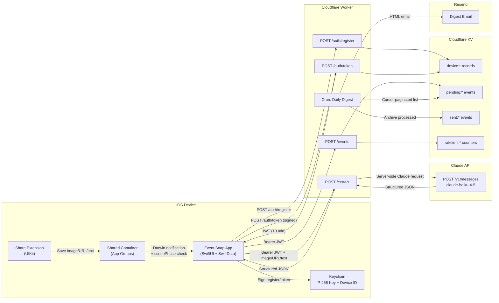

# Architecture

Event Snap is an iOS app that extracts event details from poster photos (or shared URLs/text) and creates Google Calendar events. A Cloudflare Worker provides authenticated ingestion, the daily digest email pipeline, and the production target for backend-mediated AI extraction.

**Current state vs. production target:** today, `ClaudeAPIService` calls Anthropic directly from the iOS app. Phase 0 of the roadmap moves all Claude access behind the Worker so provider secrets stay server-side and extraction requests can use the same auth, rate limiting, and observability controls as the rest of the backend.

## Tech Stack

- **iOS 17+** — SwiftUI, SwiftData, `@Observable` macro, zero SPM dependencies
- **XcodeGen** — `project.yml` → `.xcodeproj`
- **Claude API** — `claude-haiku-4-5` for vision/extraction, called server-side in the production target
- **Cloudflare Worker** — TypeScript, auth, planned extraction proxy, KV storage, cron-triggered digest
- **Resend** — transactional email for daily digest

## System Diagram

The diagram below shows the **production target** architecture. The current implementation still sends extraction requests directly from the app to Claude.



## Project Structure

```
EventImage2Calendar/                      # Main app target
├── EventImage2CalendarApp.swift          # App entry + SwiftData container
├── Models/
│   ├── EventDetails.swift                # @Observable event model (in-memory) + DTO
│   └── PersistedEvent.swift              # SwiftData @Model + EventStatus enum
├── Services/
│   ├── ClaudeAPIService.swift            # Extraction client (direct Claude today; Worker /extract in production target)
│   ├── CalendarService.swift             # Google Calendar URL + .ics generation
│   ├── BackgroundEventProcessor.swift    # Background API calls + SwiftData persistence
│   ├── LocationService.swift             # CLLocationManager wrapper
│   ├── DigestService.swift               # Local digest outbox + POST /events flush/retry
│   ├── WorkerAuthService.swift           # Device key registration + JWT retrieval
│   └── WebSearchService.swift            # Google search URL helper for descriptions
├── Views/
│   ├── ContentView.swift                 # Root (hosts EventListView)
│   ├── CameraView.swift                  # Camera sheet + ImagePicker
│   ├── EventListView.swift               # Event queue with swipe actions + DateCorrectionSheet + grouped processed list
│   ├── EventRowView.swift                # Compact list row
│   └── EventDetailView.swift             # Editable form + calendar buttons
└── Utilities/
    └── APIKeyStorage.swift               # Temporary bundle key reader for local development; removed in production target

ShareExtension/                           # Share Extension target
├── ShareViewController.swift             # NSItemProvider handler (UIKit-based)
├── ShareExtension.entitlements           # App Groups entitlement
└── Info.plist                            # Extension config + activation rules

Shared/                                   # Code shared between both targets
├── ImageResizer.swift                    # UIImage resize (1024px max, JPEG 0.7)
├── PendingShare.swift                    # Codable model for extension → app handoff
└── SharedContainerService.swift          # App Groups file read/write

cloudflare-worker/
├── wrangler.toml                         # Worker config + cron trigger (8 AM daily)
└── src/
    ├── index.ts                          # Route handlers + scheduled digest (production target adds /extract)
    ├── email.ts                          # HTML digest email builder
    ├── security.ts                       # JWT issuance/verification + ECDSA signatures
    ├── validation.ts                     # Request/payload schema validation
    └── types.ts                          # TypeScript interfaces
```

## Event Lifecycle

```
Camera / Photo Library / Share Extension
                │
                ▼
    BackgroundEventProcessor
    (UIApplication.beginBackgroundTask)
                │
                ▼
        ClaudeAPIService
    (vision extraction or URL extraction)
                │
                ▼
      Cloudflare Worker /extract
      (production target; current implementation
       still calls Claude directly)
    ┌── auto-retry (3x, exponential backoff: 2s/4s/8s)
    │   for retryable errors (network, 5xx, 429)
                │
                ▼
           Claude API
                │
                ▼
    PersistedEvent (SwiftData)
    status: processing → ready
                │
        ┌───────┴───────┐
        ▼
 "Add to Calendar"
   or export `.ics`
        │
        ▼
  status → added
        │
        ▼
 DigestService
 (queue locally, then
  POST /events with retry)
        │
        ▼
 Cloudflare Worker /events
```

**Status values:** `processing` → `ready` → `added` | `dismissed` | `failed`

**Error handling & retry:**
- `ClaudeAPIError` classifies errors as retryable (network, 5xx, 429) or permanent (4xx, decoding, no-event-found)
- `performExtraction` auto-retries retryable errors up to 3 times with exponential backoff (2s, 4s, 8s)
- Manual retry available via swipe action or detail view button, capped at 5 total attempts (`PersistedEvent.maxRetryCount`)
- On app launch: events stuck in `.processing` for >5 min are recovered to `.failed`; failed events with retryable errors are auto-retried
- Image validation: JPEG compression checked for success and 5 MB size limit before API upload

**Multi-day events:** When Claude detects a date range with no specific timed event, it returns `is_multi_day: true` with an `event_dates` array. The detail view offers two modes: "Select Days" (multi-select checklist — pick any combination of dates, each becomes a separate all-day calendar event) or "Full Event" (entire date range as one event). Multi-date selection creates multiple Google Calendar entries (opened with staggered delays) or a single ICS file containing multiple VEVENTs.

### Digest acceptance flow

Digest delivery is now an explicit post-acceptance step rather than an extraction side effect:

1. Extraction produces a local `PersistedEvent` in `.ready`
2. User explicitly accepts the event by opening Google Calendar or exporting `.ics`
3. `DigestService` marks the event `.added`, queues a local outbox record, and attempts `POST /events`
4. Failed sends remain in the local outbox as `failed` and are retried on later app activations

The local outbox tracks `notQueued` → `queued` → `sending` → `sent` | `failed`.

## Share Extension

The Share Extension is a lightweight UIKit-based app extension (~120MB memory limit) that accepts images, URLs, and text from any app's share sheet.

**Handoff pattern:** File-based via App Groups (`group.com.eventsnap.shared`).

1. Extension receives `NSItemProvider` attachments (priority: image > URL > text)
2. Extension writes a `PendingShare` JSON manifest + image data to shared container
3. Extension posts Darwin notification (`com.eventsnap.newShareAvailable`)
4. Main app picks up pending shares on notification, `scenePhase` change to `.active`, or `onAppear`
5. Main app processes through the same `BackgroundEventProcessor` pipeline as camera photos

## Extraction Pipeline

All extraction modes use Claude's **`web_search_20250305`** tool, allowing the model to verify and complete event details (dates, addresses, venues) via web search in a single API call — no separate enrichment step.

### Current implementation

`ClaudeAPIService` currently calls Anthropic directly from the app using a bundle-provided `CLAUDE_API_KEY`. This is acceptable for local development but not for a public production release because the device runtime is untrusted and the provider key is extractable.

### Production target

In the production target, the iOS app sends image/text/URL extraction requests to `POST /extract` on the Cloudflare Worker:

1. App acquires a short-lived JWT from `/auth/token`
2. App sends the extraction payload to `/extract`
3. Worker validates auth, enforces quotas and request limits, and injects the server-side Claude API key
4. Worker calls Anthropic and returns structured JSON back to the app

This keeps provider secrets server-side and centralizes rate limiting, cost controls, and operational visibility.

Three extraction modes in `ClaudeAPIService`:

- **Image extraction** (`extractEvents` / `extractEvent`): Sends base64 JPEG + structured prompt with `web_search` tool (max 5 uses). Returns a JSON **array** of events — a single image may contain multiple distinct events at different venues/times. `extractEvent` is a convenience wrapper returning the first event only.
- **Text extraction** (`extractEventFromText`): Sends page text content + `web_search` tool (max 3 uses). Truncates input to 4000 chars.
- **URL extraction** (`extractEventFromURL`): Sends bare URL + `web_search` tool (max 5 uses) — Claude searches the web to find and extract event details from the URL.

**Web search response handling:** With web search enabled, Claude's response `content` array may contain `[text, server_tool_use, web_search_tool_result, text, ...]`. The parser extracts the **last** `text` block, which contains the final JSON answer after any searches. This parsing behavior stays the same when the request path moves behind the Worker.

**Multi-event images:** When a poster/screenshot lists several events (e.g., a cultural weekend schedule with events at different venues), `extractEvents` returns one `EventDetails` per distinct event. `BackgroundEventProcessor` applies the first result to the original `PersistedEvent` and creates additional `PersistedEvent` rows for the rest.

All use shared `sendRequestRaw()` for HTTP handling (60s timeout to accommodate web search). `sendRequest()` parses a single JSON object via `EventDetailsDTO`; `sendRequestMultiple()` tries JSON array first, falls back to single object. Network errors from `URLSession` are wrapped into `ClaudeAPIError.apiError` for consistent error classification. Empty extractions (all key fields nil) throw `ClaudeAPIError.noEventFound`.

### URL Share Extraction Pipeline

When a URL is shared (from Instagram, Safari, etc.), `BackgroundEventProcessor.extractFromURL` uses a simple two-path approach:

1. **Source text available** (from share extension) → send to `extractEventFromText` with `web_search` tool
2. **No source text** → send bare URL to `extractEventFromURL` with `web_search` tool (Claude fetches page content via web search)

**Response schema:** `{ title, start_datetime, end_datetime, venue, address, description, timezone, is_multi_day, event_dates, date_confirmed, time_confirmed }`

### Missing Date/Time Handling

Claude returns `date_confirmed` and `time_confirmed` booleans alongside `start_datetime` (which is always populated — using today's date as placeholder when the date is unknown, or `T00:00:00` when the time is unknown). `EventDetailsDTO.toEventDetails()` maps these to `hasExplicitDate` and `hasExplicitTime` on `EventDetails`. `PersistedEvent.applyExtraction()` sets the event to `.failed` with a field-specific message ("Please enter the date", "Please enter the time", or both) when either flag is false.

The user sees a focused `DateCorrectionSheet` (presented from `EventListView`) that shows only the missing picker component(s) — date-only, time-only, or both. The sheet merges the user's correction with the already-extracted values (e.g., keeping the extracted time when only the date was missing) and transitions the event to `.ready`. Changing the start date automatically syncs the end date, preserving the originally extracted duration. A fallback confirmation button is also available in `EventDetailView` for events reached via navigation.

The prompt enforces consistency: if no numeric calendar date is visible anywhere in an image, all events extracted from that image must have `date_confirmed: false`. Day-of-week names (samedi, vendredi, etc.) are explicitly listed as not constituting confirmed dates.

### Swappable Components

The following components can be independently swapped or upgraded:

| Component | Location | Current Value | Notes |
|-----------|----------|---------------|-------|
| **AI Model** | `ClaudeAPIService.swift` — `"model"` key in request bodies | `claude-haiku-4-5` | Can swap to `claude-sonnet-4-6` or `claude-opus-4-6` for higher quality (at higher cost). All three extraction methods use the same model string. |
| **Web Search Tool** | `ClaudeAPIService.webSearchTool()` helper | `web_search_20250305` | Newer `web_search_20260209` adds dynamic filtering (`allowed_domains`, `blocked_domains`) but only works with Sonnet 4.6+ and Opus 4.6 (not Haiku 4.5). Upgrade requires changing the model too. |
| **API Version Header** | `ClaudeAPIService.sendRequestRaw()` — `anthropic-version` header | `2023-06-01` | Must be compatible with the web search tool version in use. |
| **User Location** | `ClaudeAPIService.webSearchTool()` — `user_location` parameter | Device timezone + country code | Provides localized web search results. Derived from `TimeZone.current` and `Locale.current.region`. Could be enhanced with reverse geocoding for city-level precision. |
| **Image Compression** | `Shared/ImageResizer.swift` | 1024px max, JPEG 0.7 | Adjust for quality vs. API payload size trade-off. |
| **Extraction Gateway** | `ClaudeAPIService.swift` + Worker `/extract` route | Direct app → Claude today | Production target moves this behind the Worker to keep provider secrets server-side and enforce quotas centrally. |
| **Digest Email Provider** | `cloudflare-worker/src/email.ts` | Resend | Any transactional email API (SendGrid, Mailgun, etc.) — swap the HTTP call in `sendDigestEmail()`. |

## Calendar Integration

`CalendarService` generates two output formats:

| Format | Timed Events | All-Day Events |
|--------|-------------|----------------|
| **Google Calendar URL** | `yyyyMMdd'T'HHmmss` | `yyyyMMdd` (end date exclusive) |
| **ICS file** | `DTSTART:20260320T190000` | `DTSTART;VALUE=DATE:20260502` (end exclusive) |

Google Calendar is opened via URL scheme (`calendar.google.com/calendar/render?action=TEMPLATE&...`). No OAuth required.

Description URLs are auto-linked as `<a href>` tags for Google Calendar rendering.

## Cloudflare Worker

### Routes

| Route | Method | Auth | Purpose |
|-------|--------|------|---------|
| `/auth/register` | POST | Signed payload | Register device public key |
| `/auth/token` | POST | Signed payload | Issue 10-min JWT |
| `/events` | POST | Bearer JWT | Accept event payload |
| `/health` | GET | None | Health check |

### Planned Production Routes

| Route | Method | Auth | Purpose |
|-------|--------|------|---------|
| `/extract` | POST | Bearer JWT (App Attest once enabled) | Proxy Claude extraction with server-side provider secret |
| `/attest/challenge` | POST | Signed payload | Issue App Attest challenge |

### Event Ingestion

`POST /events` is idempotent at the storage-key level: the Worker stores pending digest entries under a stable `pending:{deviceId}:{eventId}` key so repeated client retries overwrite the same pending item rather than creating duplicates.

### Scheduled Job

Daily cron (8 AM) collects `pending:*` events from KV with cursor-based pagination, sorts by start date, sends HTML digest via Resend in batches of 100, and archives each successful chunk to `sent:*` immediately after that chunk is delivered.

**Current vs. target recipient model:** today, digest delivery is configured to a single `DIGEST_EMAIL_TO`. The production target moves this to per-user recipients and preferences once user identity is added.

### Digest Delivery Semantics

- The client outbox makes digest submission retryable across transient auth/network failures.
- Worker-side idempotent pending keys prevent duplicate queue records from client retries.
- Per-chunk archival reduces duplicate-email risk if a later chunk fails during the same cron run.
- All-day events are carried explicitly in the payload and rendered as date-only / "All day" in digest emails.

### Deferred Atomic Queue Upgrade

The current design intentionally stops short of a fully atomic queue. It uses a local client outbox plus idempotent KV writes for practical reliability, but does not guarantee strict exactly-once delivery if an email send succeeds and archival fails immediately afterward. A stronger queue backed by D1 transactions or a Durable Object coordinator is deferred until scale or operational evidence justifies the extra complexity.

### Rate Limiting

KV-backed counters (eventually consistent):
- 120 events/device/hour
- 30 events/IP/minute

**Production target:** Durable Objects replace KV-based counters on the hot path for atomic rate limiting, with Cloudflare WAF rules on `/events` and `/extract`.

### Environments

The production target uses separate `dev`, `staging`, and `production` Worker environments, each with:

- Distinct KV namespaces
- Distinct secrets
- Distinct email sender configuration
- A documented promotion path from staging to production

## Security

### Authentication Flow

1. **Device registration:** iOS generates P-256 signing key in Keychain on first launch. Signs `register:{deviceId}:{timestamp}` and posts public key + signature to `/auth/register`.
2. **Token issuance:** Signs `token:{deviceId}:{timestamp}` and posts to `/auth/token`. Worker verifies ECDSA signature, issues HMAC-SHA256 JWT (10 min TTL, `events:write` scope, device-bound).
3. **Extraction request (production target):** `POST /extract` with `Authorization: Bearer <jwt>`. Worker validates JWT signature, expiration, scope, request size, and rate limits before calling Claude.
4. **Event submission:** `POST /events` with `Authorization: Bearer <jwt>`. Worker validates JWT signature, expiration, scope, and payload schema.

### Trust Boundaries

- **iOS app/device runtime** — untrusted against reverse engineering
- **Cloudflare Worker** — enforcement boundary for auth, validation, rate limiting, and production Claude access
- **Cloudflare KV** — trusted for persistence; rate limiting is eventually consistent
- **Resend** — external processor, receives only validated/sanitized data
- **Claude API key** — must remain server-side only in the production target

### Request Validation

- `application/json` content-type enforcement, 32KB body limit
- Field-level validation: title (1-200 chars), description (0-4000), venue/address (0-200), URL (0-2048)
- Date parsing, ordering, timezone validation (via `Intl` API)
- Timestamp freshness (5-minute skew tolerance)

### Output Sanitization

- HTML text fields escaped in digest emails
- `googleCalendarURL` allowlisted and protocol-constrained (HTTPS only, `calendar.google.com`)

### Secrets Management

| Secret | Current Location | Production Target | Purpose |
|--------|------------------|-------------------|---------|
| `CLAUDE_API_KEY` | `Secrets.xcconfig` (gitignored) | Wrangler/server secret only | Claude API access |
| `RESEND_API_KEY` | Wrangler secret | Wrangler secret per environment | Email sending |
| `DIGEST_EMAIL_TO` | Wrangler secret | Replaced by per-user recipient data | Digest delivery |
| `JWT_SIGNING_SECRET` | Wrangler secret | Wrangler secret per environment with rotation | JWT HMAC signing |

**Rotation:** Rotate `JWT_SIGNING_SECRET` immediately if compromised. All existing tokens become invalid (by design — 10-min TTL limits exposure). Production target adds multi-key rotation with active + grace windows.

### Known Limitations

- Device identity is per-install; no user account identity yet
- Device registration is signature-verified but not hardware-attested
- KV rate limiting is eventually consistent, not strongly atomic
- Digest queue is retryable and idempotent, but not fully atomic end-to-end
- No centralized monitoring/alerting pipeline

## Testing & CI

### Worker Tests

- JWT issuance and verification (valid, expired, wrong scope, tampered)
- ECDSA device signature verification
- Event/register/token payload validation
- URL allowlisting
- KV cursor pagination behavior

### CI Pipeline

- Worker: dependency install, TypeScript typecheck, test suite
- iOS: simulator build validation
- Security: gitleaks secret scanning
