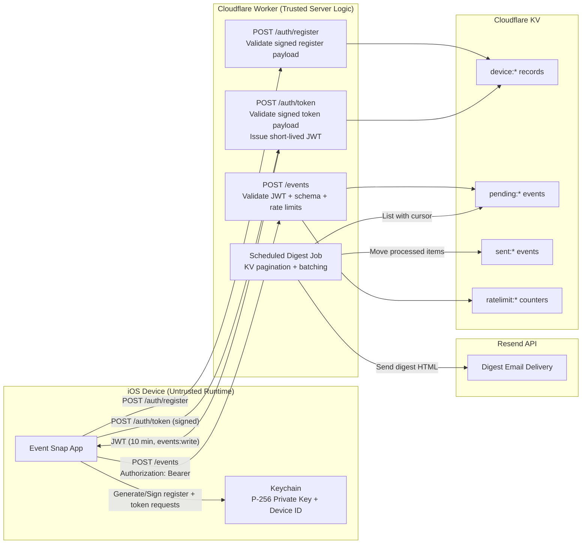

# Security Architecture (March 6, 2026)

## Overview

This diagram reflects the current deployed security architecture after removing static app-shipped worker secrets and moving to device-bound token issuance.

## Trust Boundaries

- `iOS app binary/device runtime` is untrusted against reverse engineering.
- `Cloudflare Worker` is the enforcement boundary for auth, validation, rate limiting, and digest workflow controls.
- `Cloudflare KV` is trusted for persistence, but rate-limiting on KV is eventually consistent.
- `Resend` is an external processor used only after event data is validated and sanitized.

## Security Properties Achieved

- No shared static worker auth secret shipped in app bundle.
- Event ingestion requires short-lived signed JWT access token.
- Device registration/token issuance requires proof of private-key possession.
- Event payload validation enforces field constraints and date sanity.
- Digest processing paginates KV reads to avoid missing records at scale.
- Calendar links in digest emails are allowlisted and protocol-constrained.

## Remaining Improvement Opportunities

1. Add App Attest verification to strengthen app/device provenance (prevent scripted key registration abuse).
2. Add user identity (e.g., Sign in with Apple) and bind data/actions to user + device instead of device-only identity.
3. Replace KV counter rate limits with stronger consistency primitives (Durable Objects or Cloudflare WAF rate limits).
4. Add centralized security telemetry/alerting for auth failures, rate-limit breaches, and digest send anomalies.
5. Add formal key-rotation runbooks and automation for `JWT_SIGNING_SECRET`.
